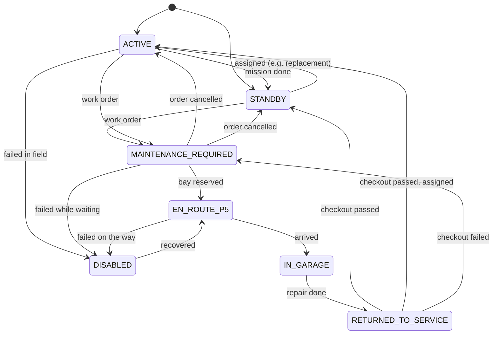

# Technical decisions: PDR baseline

Project: NASA HUNCH 2026-27 SFT, LLASO Project 4 (LLASO-P4-AI-MAINT-2026), AI predictive maintenance for lunar robots.
Scope: Missions 1-6, P2 transport robot only, rule-based thresholds plus trend extrapolation (no machine learning).

These decisions were fixed before this document and are not re-argued here: P2 only, rules not ML, Python 3.11 + pandas/numpy, static HTML dashboard, Parquet + JSON, exactly four fault types, we own both sides of the P5 interface, mandatory answer key.

**How numbers are labelled.** Every number below has one of these sources:

| Label | Meaning |
|---|---|
| **Physics** | Follows from a physical law written out in §4 |
| **Constant** | Published physical constant (named) |
| **Typical** | Typical datasheet value for this kind of part. Still a team estimate until we pick a real part |
| **Derived** | Computed from other values in this document with the §4 equations (shown) |
| **Team estimate** | Our judgement. Not sourced. Expect to change it |

Nearly everything is a team estimate or derived from one. That is honest and expected for a simulation-first project. The config files carry a `source` field so this stays visible in the code.

The machine-readable versions of these decisions live in [`config/`](../config). Code reads only those files.

---

## 1. Channel list

**Decision:** 17 measured channels plus 4 record fields. File: [`config/channels.json`](../config/channels.json).

Record fields (every row): `robot_id` (string), `t_s` (int64, seconds since scenario start), `timestamp` (UTC, ms), `op_mode` (category).

Hierarchy, as the HUNCH deck requires: every channel belongs to exactly one **component**, every component to exactly one **subsystem**, subsystems roll up to the **system** (one robot), robots roll up to the **fleet**.

| Channel (machine name) | Label | Units | dtype | Nominal (mode) | WARNING | CRITICAL | Hard limit (any mode) | Component | Subsystem | Diagnostic for |
|---|---|---|---|---|---|---|---|---|---|---|
| `wheel_{w}_current_a` ×4 | {W} drive motor current | A | float32 | 3.0-3.6 (TRAVERSE_EMPTY) | baseline +1.0 | baseline +2.0 | ≥ 8.0 | `wheel_{w}_drive` | MOBILITY | bearing_wear, wheel_drag, cooling_fault (stays normal) |
| `wheel_{w}_speed_rads` ×4 | {W} wheel speed | rad/s | float32 | 2.15-2.35 (TRAVERSE_EMPTY) | baseline −0.08 | baseline −0.15 | - | `wheel_{w}_drive` | MOBILITY | bearing_wear, wheel_drag (confirming), cooling_fault (stays normal) |
| `wheel_{w}_temp_c` ×4 | {W} drive temperature | °C | float32 | 31-37 (TRAVERSE_EMPTY) | baseline +15 | baseline +30 | ≥ 90 | `wheel_{w}_thermal` | THERMAL | bearing_wear, wheel_drag (stays explained), cooling_fault |
| `battery_voltage_v` | Battery pack terminal voltage | V | float32 | 44-54 (depends on SOC) | model −0.5 | model −1.0 | ≤ 42.0 or ≥ 54.6 | `battery_pack` | POWER | battery_degradation |
| `battery_current_a` | Battery pack current (+ = discharge) | A | float32 | 2.5-3.1 (TRAVERSE_EMPTY) | baseline +1.5 | baseline +3.0 | ≤ −15 or ≥ 20 | `battery_pack` | POWER | battery_degradation (gives the load) |
| `battery_soc_pct` | Battery state of charge | % | float32 | 30-100 | < 30 (absolute) | < 15 (absolute) | - | `battery_pack` | POWER | battery_degradation (gives expected V_oc) |
| `lift_joint_current_a` | Cargo-lift actuator current | A | float32 | 1.7-2.3 (CARGO_HANDLING) | baseline +1.0 | baseline +2.0 | ≥ 6.0 | `lift_actuator` | MECHANISMS | none (see below) |
| `lift_joint_pos_err_deg` | Cargo-lift position error | deg | float32 | 0.2-0.6 (CARGO_HANDLING) | baseline +0.5 | baseline +1.5 | - | `lift_actuator` | MECHANISMS | none (see below) |

`{w}` is `fl`, `fr`, `rl`, `rr` (front-left, front-right, rear-left, rear-right).

- "baseline" means the expected value for the robot's current operating mode (§2). "model" means the battery model value V_oc(SOC) − I × R_nominal.
- Nominal ranges are **Derived** from the §4 equations with team-estimate parameters (§5). WARNING/CRITICAL offsets are **Team estimates**, chosen to sit well clear of noise (the current WARNING offset is about 6σ of healthy fluctuation) and so that each fault's primary channel reaches CRITICAL right at failure.
- Hard limits: 8 A driver limit, 90 °C insulation/grease limit, 20 A/−15 A pack ratings are **Team estimates**. 42.0 V cut-off and 54.6 V (13 × 4.2 V) maximum are **Typical** Li-ion values.

**Components** (sensing domain from the deck): four `wheel_{w}_drive` (external: dust, abrasion), four `wheel_{w}_thermal` heat-rejection paths (external), `battery_pack` (internal), `lift_actuator` (external).

### Why each channel is in the list (the minimality argument)

| Channel family | Which fault needs it, and why |
|---|---|
| Wheel current (×4) | bearing_wear and wheel_drag both show as a current rise. Current staying normal is the only thing that separates cooling_fault from bearing_wear (both heat up). Per-wheel, because faults are on one wheel and the other three are the best healthy reference. |
| Wheel temperature (×4) | The only channel that separates bearing_wear from wheel_drag (the central case). Primary channel for cooling_fault. |
| Battery voltage | Primary channel for battery_degradation. |
| Battery current | battery_degradation is "sag **under load**": the sag is I × ΔR, so it means nothing without I. |
| Battery SOC | V_oc depends on SOC. Without it a flat battery looks like a degraded one. Also the "battery level" Mission 1 must display. |
| Wheel speed (×4) | **Not strictly needed** to separate the four faults. Kept because HUNCH requires it (Mission 1 displays wheel speed, Mission 2 names "unusual wheel speed"). It is useful confirming evidence (a real load increase must also slow the wheel, so a lone current rise points to a sensor problem) and the detector's thermal model uses it for friction heat. |
| Lift current, lift position error | **No PDR fault needs them.** Kept only because HUNCH requires joint telemetry and Mission 1 must show joint status. This is open question Q3. |

### Considered and left out

| Candidate | Why not now |
|---|---|
| Per-cell battery voltages, BMS impedance estimate | Would make battery_degradation trivial to spot (the BMS would be doing our job), and 13 more channels. Pack-level is enough to show the method. Add after PDR. |
| Wheel slip ratio | Would independently confirm wheel_drag, but needs vehicle ground speed (odometry), so a second model. Post-PDR candidate. |
| Avionics temperature, radiation/watchdog counters | Named in the deck, but none of our four faults involves them. |
| Ambient / radiator sink temperature | Held constant in the generator for PDR. Becomes necessary if the sink temperature varies (Q5). |
| Vibration | The best real-world bearing indicator, but it needs kHz sampling. Out of scope at 1 Hz. |
| Steering actuators | We assume skid steering: no steering joints (Q1). |

---

## 2. Operating modes

**Decision:** five modes. Every reading is judged against the baseline for the robot's **current** mode. File: [`config/modes.json`](../config/modes.json).

| Mode | What the robot is doing | Generator inputs |
|---|---|---|
| `IDLE` | Parked, avionics on, wheels and lift stopped | drive 0 V |
| `TRAVERSE_EMPTY` | Driving, no cargo (**reference mode**) | drive 5.0 V, cargo 0 kg |
| `TRAVERSE_LOADED` | Driving with a 200 kg load | drive 5.0 V, cargo 200 kg |
| `CARGO_HANDLING` | Parked, lift moving (loading/unloading at P3) | drive 0 V, lift 2.0 A |
| `CHARGING` | Parked on the charger | drive 0 V, charger 10 A |

The robot reports its mode in every sample (`op_mode`), the way a real robot knows what it was commanded to do.

### Baselines per mode (offset from TRAVERSE_EMPTY in brackets)

| Channel | IDLE | TRAVERSE_EMPTY | TRAVERSE_LOADED | CARGO_HANDLING | CHARGING |
|---|---|---|---|---|---|
| `wheel_{w}_current_a` (A) | 0.00 (−3.29) | **3.29** | 4.81 (+1.52) | 0.00 (−3.29) | 0.00 (−3.29) |
| `wheel_{w}_speed_rads` (rad/s) | 0.00 (−2.25) | **2.25** | 2.14 (−0.11) | 0.00 (−2.25) | 0.00 (−2.25) |
| `wheel_{w}_temp_c` (°C, steady state) | 20.0 (−13.7) | **33.7** | 42.7 (+9.0) | 20.0 (−13.7) | 20.0 (−13.7) |
| `battery_current_a` (A) | 1.25 (−1.53) | **2.78** | 3.49 (+0.71) | 1.81 (−0.97) | −10.00 (−12.78) |
| `battery_voltage_v` | model | model | model | model | model (above V_oc while charging) |
| `battery_soc_pct` | absolute limits only | | | | |
| `lift_joint_current_a` (A) | 0.00 | **0.00** | 0.00 | 2.00 (+2.00) | 0.00 |
| `lift_joint_pos_err_deg` (deg) | 0.05 | **0.05** | 0.05 | 0.40 (+0.35) | 0.05 |

Source: **Derived** from §4 with §5 parameters, battery values at SOC 50 %, then rounded. Worked example for TRAVERSE_EMPTY:
rolling torque per wheel = 0.15 × 400 kg × 1.62 m/s² × 0.25 m / 4 = 6.08 N·m; plus 0.5 N·m bearing friction = 6.58 N·m → I = 6.58 / 2.0 = **3.29 A** (E2) → ω = (5.0 − 3.29 × 0.15) / 2.0 = **2.25 rad/s** (E3) → heat = 3.29² × 0.15 + 0.5 × 2.25 = 2.75 W (E4) → T = 20 + 5.0 × 2.75 = **33.7 °C** (E5 steady state) → bus power = 4 × 5.0 × 3.29 / 0.9 + 60 = 133 W → I_batt = **2.78 A** (E6, E7).

**Why a flat threshold fails:** loaded driving draws 4.81 A per wheel. A flat limit tuned for empty driving (3.29 + 1.0 = 4.29 A) would raise a WARNING every time a robot picks up cargo.

### Three rules that go with the baselines

1. **Thermal lag.** Temperature cannot jump when the mode changes (τ = 600 s). The temperature baseline moves toward the new mode's steady state through the same first-order lag (`config/detector.json` → `thermal_model.tau_s`). Without it, every cool-down after a drive would look like overheating relative to IDLE.
2. **Mode-change grace.** For 30 s after a mode change, skip the relative checks on `per_mode` channels (start-up current spikes). Hard limits always apply.
3. **Battery voltage uses a model, not a table.** Its baseline is V_oc(SOC) − I × R_nominal, because voltage depends on charge and load, not just mode.

---

## 3. Sample rate and record cadence

**Decision:** sample at **1 Hz**. Package samples into **60 s batches**: the unit that is transmitted, ingested, stored and evaluated. Source: **Team estimate**, reasoning below.

| Item | Value | Why |
|---|---|---|
| Sample rate | 1 Hz (each sample = 1 s average of the robot's faster internal loop) | Our faults develop over tens of minutes. The drive thermal time constant is 600 s. A 15-min lead time is 900 samples, and a 30-min trend window is 1,800 points, plenty for a solid regression. 10 Hz would be 10× the data with no new information at these time scales. |
| Batch (record cadence) | 60 s, one Parquet row group per batch | Matches a plausible downlink cadence. Detection latency is at most 60 s + 5 s persistence, small next to a 15-min lead-time goal. |
| Evaluation cadence | Every batch | Health, anomalies, trends, diagnosis and dashboard feeds all update once a minute. |
| Dashboard resolution | 1-minute means, last 2 h (121 points per channel) | Keeps feed files about 50 KB per robot. |
| Scenario length | healthy 2 h; bearing wear 4 h (inject at 1 h, failure at 3.5 h) | Long enough to show a 15-min+ lead time, the work order, the dispatch and the standby swap. |

**File sizes (estimate):** a row is 17 float32 + keys ≈ 90 bytes. A 4 h, 5-robot run = 72,000 rows ≈ 6.5 MB in memory and a few MB of Parquet. Fine. Mission 12 (30 days, later) would be about 13 M rows (≈ 1.2 GB in memory), so it will need per-minute decimation. Not a PDR problem.

Vibration-based bearing diagnosis (what the Case Western data is for) needs kHz sampling. That is deliberately out of scope.

---

## 4. Physical relationships the generator must obey

**Decision:** the generator computes every channel from a small set of physical equations, so channels move together the way real ones do. Magnitudes are scaled and do not match a real lunar rover. The **relationships** between channels are what must be right. Code: [`p4maint/generator/physics.py`](../p4maint/generator/physics.py), one function per equation. Parameters: [`config/generator.json`](../config/generator.json).

Each wheel motor is a DC motor lumped at the wheel shaft (gear ratio folded into K_t and K_e). Motor electrical and mechanical time constants are far below 1 s, so motors are at steady state every sample. Only temperature and SOC have memory.

**Mobility (per wheel)**

| # | Equation | Meaning |
|---|---|---|
| E1 | τ_load = C_rr · m_total · g / n_wheels · r_wheel + τ_b0 + Δτ_bearing + Δτ_drag + τ_terrain | Load torque: rolling resistance + bearing friction (+ bearing_wear) + regolith drag (+ wheel_drag) + terrain noise |
| E2 | I = τ_load / K_t | Motor current is proportional to load torque |
| E3 | ω = (V_drive − I · R_arm) / K_e   (0 when parked) | More current → more voltage lost in the winding → **slower wheel** |

**Thermal (per wheel drive)**

| # | Equation | Meaning |
|---|---|---|
| E4 | P_heat = I² · R_arm + (τ_b0 + Δτ_bearing) · ω | Heat into the hub = copper loss + bearing friction heat. **Drag torque is not here**: its work goes into the soil. This one line makes bearing_wear and wheel_drag separable. |
| E5 | C_th · dT/dt = P_heat − (T − T_sink) / R_th,   R_th = R_th0 · r_th_multiplier | First-order heating and decay toward the sink. Euler step: T ← T + dt/C_th · (P_heat − (T − T_sink)/R_th). cooling_fault raises R_th. |

**Power**

| # | Equation | Meaning |
|---|---|---|
| E6 | P_bus = Σ_wheels V_drive · I_w / η + P_hotel + V_lift · I_lift / η | Power drawn from the pack |
| E7 | I_batt = (V_oc − √(V_oc² − 4 · R_int · P_bus)) / (2 · R_int) | Solves P_bus = V_term · I with V_term = V_oc − I · R_int. Negative under the root = brown-out. When charging, I_batt = −I_charger. |
| E8 | V_term = V_oc(SOC) − I_batt · R_int,   R_int = R_int0 · r_int_multiplier | **Sag under load** = I · R_int. battery_degradation raises R_int, so sag grows with both load and time. |
| E9 | SOC ← SOC − I_batt · dt / (3600 · Q_Ah) · 100 | Coulomb counting |
| E10 | V_oc(SOC) = straight-line interpolation in the OCV table | Open-circuit voltage curve |

**Noise and faults**

| # | Equation | Meaning |
|---|---|---|
| E11 | x ← φ·x + σ·√(1−φ²)·N(0,1),  φ = e^(−dt/τ_corr) | Terrain torque disturbance (AR(1)), per moving wheel. Enters E1, so current, speed and temperature fluctuate *together*. |
| E12 | y = x_true + N(0, σ_sensor), then quantise | Independent sensor noise added after the physics |
| E13 | p = ((t − t_inject)/T_fail)^n, clipped to [0, 1];  param = healthy + p · (at_failure − healthy) | Fault progress. True failure is when p reaches 1. |

**What these give us** (checked by hand, to be confirmed by `tests/test_generator.py`):
- Bearing wear at failure (Δτ = 2.2 N·m, TRAVERSE_EMPTY): current +1.1 A, speed −0.08 rad/s, temperature +30 °C, most of it unexplained by current.
- Wheel drag at failure (Δτ = 4.0 N·m): current +2.0 A, speed −0.15 rad/s, temperature only +12.5 °C, **all** of it explained by I²R.
- Cooling fault at failure (R_th × 3.2): temperature +30 °C with current and speed unchanged.
- Battery degradation at failure (R_int × 5.5): an extra −1.0 V of sag at 2.78 A, more at higher load.

---

## 5. Noise and degradation parameters

**Decision:** all values below are **team estimates** unless marked. They live in [`config/generator.json`](../config/generator.json) (world truth) and [`config/faults.json`](../config/faults.json) (fault magnitudes).

| Parameter | Value | Source |
|---|---|---|
| Lunar gravity g | 1.62 m/s² | **Constant** (NASA Moon Fact Sheet) |
| Robot mass / cargo | 400 kg / 200 kg | Team estimate |
| Wheels, radius | 4, 0.25 m | Team estimate (Q1) |
| Rolling resistance C_rr on regolith | 0.15 | Team estimate, needs a terramechanics citation |
| K_t = K_e | 2.0 N·m/A (V·s/rad) | Team estimate (K_t = K_e in SI is **Physics**) |
| R_arm | 0.15 Ω | Team estimate, chosen so the motor is about 90 % efficient. That keeps wheel_drag's I²R warming inside the NORMAL band. |
| Bearing friction τ_b0 | 0.5 N·m | Team estimate |
| Driver efficiency η | 0.90 | Team estimate |
| R_th, C_th (τ = 600 s) | 5.0 K/W, 120 J/K | Team estimate |
| Sink temperature | 20 °C, constant | Team estimate (Q5) |
| Pack | 13S Li-ion, 50 Ah, R_int0 = 0.08 Ω | Team estimate. 13S window 39-54.6 V is **Typical** |
| OCV table | 0 % 39.0 V … 100 % 54.0 V (7 points) | Team estimate shaped like a typical NMC curve |
| Hotel load | 60 W | Team estimate |
| Terrain noise | σ = 0.3 N·m, τ_corr = 20 s | Team estimate |
| Sensor noise σ | current 0.05 A, speed 0.01 rad/s, temp 0.2 °C, voltage 0.03 V, pack current 0.05 A, lift 0.03 A / 0.02° | Team estimate |
| SOC quantisation | 0.1 % | Team estimate |
| Fault magnitudes at failure | see [FAILURE_MODES.md](FAILURE_MODES.md#injected-magnitudes-team-estimates) | Derived via the calibration rule (§4) |
| Progression exponents | bearing 2.0, drag 1.0, cooling 1.0, battery 1.5 | Team estimate (bearing wear usually accelerates) |

### Where real calibration data could come from (nothing is downloaded)

`config/generator.json` → `calibration_slots` and each fault's `calibration.slots` in `config/faults.json` are `null` placeholders. Fill a slot only from data, and record where the number came from in `filled_from`.

| Slot | Candidate source | What it would give us |
|---|---|---|
| Battery OCV table, R_int0, R_int growth | NASA Prognostics Center of Excellence (PCoE) data repository, Li-ion battery ageing set (18650 cells cycled with impedance measurements) | Real shape of OCV(SOC) and of resistance growth over life |
| Bearing degradation shape | NASA PCoE repository, IMS (University of Cincinnati) bearing run-to-failure set | How fast wear accelerates toward failure |
| Bearing fault signatures | Case Western Reserve University Bearing Data Center | Vibration at kHz with seeded faults. **Only useful if we add a vibration channel**; it says nothing directly about 1 Hz current or temperature trends. |
| Sensor noise | Bench measurements on our own RC robot / stepper rig (a HUNCH-approved data source) | Real σ for current, speed and temperature sensors |
| Rolling resistance, dust-on-radiator rate | Literature still to be found | C_rr and the cooling-fault growth rate |

---

## 6. Schema file format

**Decision:** the channel schema is a **plain JSON table**, [`config/channels.json`](../config/channels.json), and is itself checked by a JSON Schema ([`schemas/channels_config.schema.json`](../schemas/channels_config.schema.json)). Every limit, baseline type and hierarchy link is read from it through [`p4maint/configs.py`](../p4maint/configs.py). **No code may hardcode a threshold.**

Why this format:
- **Not YAML:** it needs PyYAML (a new dependency), browsers cannot read it natively, and indentation mistakes are silent.
- **Not JSON Schema as the definition itself:** JSON Schema describes the *shape* of data, not engineering facts like "WARNING at baseline + 15 °C". We use JSON Schema to *validate* the table instead.
- **Plain JSON:** readable by Python and the dashboard without extra libraries, diff-friendly in git, and the deck allows JSON for configuration.

### Where this sits in the deck's three-layer format stack

| Layer | Deck recommends | PDR uses | Path to the full stack |
|---|---|---|---|
| Transmit | CCSDS Space Packets defined with XTCE | In-memory 60 s batches; `telemetry_batch` JSON for fixtures and debugging only | Generate XTCE parameter definitions from `channels.json` (one channel row = one parameter) and put a packet encoder/decoder in front of ingest. Ingest still outputs the same DataFrame, so nothing downstream changes. **Not implemented for PDR.** |
| Store / analyse | Apache Parquet or HDF5 | Parquet, columns generated from `channels.json` | Already in place |
| Vocabulary | ISO 13374 / MIMOSA OSA-CBM | Our module boundaries follow its processing blocks: data acquisition and manipulation = `generator` + `ingest`; state detection = `health` + `detect`; health assessment = `diagnose`; prognostic assessment = `predict`; advisory generation = `workorders` + `fleet` | Map contract field names onto OSA-CBM terms if judges ask |

CSV and plain JSON are not used as a transmit format. JSON is used for config, state objects and ground reporting, which the deck allows.

---

## 7. JSON contracts

**Decision:** every object that crosses a module boundary or reaches the dashboard has a JSON Schema (draft 2020-12) in [`schemas/`](../schemas) and at least one hand-made example in [`fixtures/`](../fixtures). Validate any file with `python schemas/validate.py <file>`; `make validate` checks them all.

| Contract | Schema | Example | Key choices |
|---|---|---|---|
| Shared definitions | `common.schema.json` | - | ids, enums, timestamps. Enums that mirror config are cross-checked by `tests/test_config.py`. |
| Telemetry sample / batch | `telemetry_batch.schema.json` | `fixtures/contracts/telemetry_batch.example.json` | One robot, 60 samples, one object per sample. Channel keys are data-driven (tests check them against `channels.json`). `null` = sensor dropout. |
| Health snapshot | `health_snapshot.schema.json` | `fixtures/contracts/health_snapshot.example.json` | Nested robot → subsystem → component → channel (the deck's hierarchy). Each channel carries value, baseline, deviation, status and the `rule` that decided it. Status is worst-of at each level. |
| Anomaly event | `anomaly_event.schema.json` | `fixtures/contracts/anomaly_event.example.json` | `t_s` = when it started, `detected_t_s` = when we noticed. `magnitude` = value − baseline, in the channel's units. |
| Prediction | `prediction.schema.json` | `fixtures/contracts/prediction.example.json` | Diagnosis + time-to-failure + **its evidence, stored together**: all candidates scored, observed signature, residuals, trend fit, anomaly ids, and the evidence window (robot, start, end, channels, Parquet source). |
| Work order | `work_order.schema.json` | `fixtures/contracts/work_order.example.json` | **v1.0.0, designed as an external hand-off.** Self-contained: up to 61 points per evidence channel embedded, so P5 needs no access to our store. Plain-language summary. Recommended action with repair time and parts. Append-only `history`. Queue `priority`, reserved `bay_id`, `source` with run id. |
| Fleet state | `fleet_state.schema.json` | `fixtures/contracts/fleet_state.example.json` | Health appears only as status + score, never raw telemetry, so fleet logic stays separate from detection. `standby` = can be sent as a replacement **right now** (STANDBY + NORMAL + SOC ≥ 60 %). Mission roster with `covered` flag. |
| Garage queue | `garage_queue.schema.json` | `fixtures/contracts/garage_queue.example.json` | `capacity`, one entry per bay (EMPTY / RESERVED / OCCUPIED, i.e. the occupants), `queue` in order with positions from 1. |
| Event log line | `event_log_entry.schema.json` | `fixtures/contracts/event_log.example.jsonl` | **Append-only** JSON Lines. `refs.caused_by_event_id` chains each decision to its cause. Full contract object in `payload`. |
| Dashboard feeds | `dashboard_index`, `dashboard_fleet_board`, `dashboard_robot_detail`, `dashboard_alerts`, `dashboard_work_orders` | `fixtures/healthy_fleet/`, `fixtures/active_work_order/` | What the page actually reads. Python pre-joins, pre-formats and pre-computes the limit bands so the JavaScript only draws. |
| Scenario | `scenario.schema.json` | `scenarios/*.json` | §9 |
| Answer key | `ground_truth.schema.json` | `fixtures/contracts/ground_truth.example.json` | Read only by `p4maint/scoring`. |

**Conventions**
- **Versioning:** every contract has `schema_version` "MAJOR.MINOR.PATCH". Readers accept any `1.x.y`. Adding an optional field = minor bump. Renaming, removing or changing a field's meaning = major bump, with the fixtures updated in the same commit.
- **Time:** `t_s` (seconds since scenario start; simple arithmetic) plus an ISO 8601 UTC timestamp ending in `Z` (human-readable, unambiguous).
- **Status vs severity:** health *status* is NORMAL / WARNING / CRITICAL / UNKNOWN (UNKNOWN = no fresh data). Event *severity* (anomaly, prediction, work order) is WARNING / CRITICAL only. Queue order uses a separate numeric `priority`. Two levels keep Mission 1's vocabulary everywhere; Mission 8 can refine `priority` later without touching severity.
- **Ids:** `AN-000001`, `PR-000001`, `EV-000001` (per run), `WO-YYYYMMDD-NNNN`, robots `P2-01`, missions `M-...`.

---

## 8. Robot state machine

**Decision:** seven robot states and six work-order states. Every legal transition is listed in [`config/state_machine.json`](../config/state_machine.json). Anything not listed is rejected at runtime: [`p4maint/fleet/state_machine.py`](../p4maint/fleet/state_machine.py) raises `IllegalTransition`. Staying in the same state is not a transition.



| State | In service? | What the simulated robot does | Meaning |
|---|---|---|---|
| `STANDBY` | no | IDLE | Healthy reserve, available as a replacement |
| `ACTIVE` | yes | its mission's mode cycle | Working a mission |
| `MAINTENANCE_REQUIRED` | yes | mission if the order is WARNING, IDLE if CRITICAL | Work order open, waiting for a P5 bay |
| `EN_ROUTE_P5` | no | TRAVERSE_EMPTY for 900 s | Bay reserved, driving to P5 |
| `IN_GARAGE` | no | IDLE | Being repaired. No new work orders. |
| `RETURNED_TO_SERVICE` | no | IDLE | Released by P5, awaiting checkout |
| `DISABLED` | no | IDLE | **Added beyond the HUNCH minimum.** Failed before reaching P5 and cannot drive. Without it, a missed prediction has nowhere to go. |

The full transition table with triggers is in `config/state_machine.json` (16 robot transitions). `MAINTENANCE_REQUIRED → ACTIVE/STANDBY` ("order cancelled") exists now so that the robot self-diagnostic override (Mission 7, later) can be added without changing the state machine.

**Work orders:** `OPEN → QUEUED → DISPATCHED → IN_REPAIR → COMPLETED`, plus `CANCELLED` from OPEN, QUEUED or DISPATCHED. COMPLETED and CANCELLED are final. Work-order moves drive robot moves: QUEUED ↔ MAINTENANCE_REQUIRED, DISPATCHED ↔ EN_ROUTE_P5, IN_REPAIR ↔ IN_GARAGE, COMPLETED ↔ RETURNED_TO_SERVICE.

**When the standby is swapped in** (`config/dispatch.json`): CRITICAL orders swap immediately when the order is created (the failing robot stops). WARNING orders let the robot keep working until it is dispatched, and swap then. Standby choice: eligible = STANDBY + NORMAL health + SOC ≥ 60 %; pick the highest SOC, then the lowest id. Every candidate considered is written to the event log.

---

## 9. Scenario definition format

**Decision:** one JSON file per scenario in [`scenarios/`](../scenarios), validated by [`schemas/scenario.schema.json`](../schemas/scenario.schema.json). **Same file + same seed = identical telemetry.**

```jsonc
{
  "schema_version": "1.0.0",
  "scenario_id": "bearing_wear_p2_02",          // also names the run folder: runs/<id>__seed<seed>/
  "description": "...",
  "seed": 20270302,                               // the ONLY source of randomness
  "start_time_utc": "2027-03-01T00:00:00Z",
  "duration_s": 14400,                            // multiple of the 60 s batch
  "garage_capacity": 1,                           // optional override of config/dispatch.json
  "missions": [
    {"mission_id": "M-HAUL-B", "label": "Lander B to depot haul",
     "mode_cycle": [{"mode": "CARGO_HANDLING", "duration_s": 240},
                    {"mode": "TRAVERSE_LOADED", "duration_s": 1500}, ...]}   // repeats
  ],
  "robots": [
    {"robot_id": "P2-02", "robot_type": "P2_TRANSPORT", "initial_status": "ACTIVE",
     "mission_id": "M-HAUL-B", "initial_soc_pct": 92.0, "location": {"zone": "HAUL_ROUTE_2"}},
    {"robot_id": "P2-04", "robot_type": "P2_TRANSPORT", "initial_status": "STANDBY",
     "mission_id": null, "initial_soc_pct": 100.0, "location": {"zone": "STANDBY_PARK"}}
  ],
  "faults": [                                     // [] for a healthy run
    {"fault_id": "F1", "robot_id": "P2-02", "fault_type": "bearing_wear",
     "component": "wheel_fl_drive", "inject_at_s": 3600, "time_to_failure_s": 9000,
     "progression": {"shape": "power", "exponent": 2.0}}   // optional; default from faults.json
  ]
}
```

**Reproducibility rules**
- All randomness comes from `seed`. One numpy random generator per robot, spawned from `SeedSequence(seed)` in sorted `robot_id` order. Adding a robot never changes another robot's data. The global numpy and Python random states are never used.
- Missions are a repeating mode cycle on a **mission clock** (scenario time). A replacement robot picks up the cycle where the mission is, not from the start.
- The generator is **closed loop**. Each batch it reads the current fleet state, so a robot sent to P5 drives there and a standby put into service starts the mission. The faults and their timing are fixed by the file, so the answer key is known before the run starts.
- The run id is `<scenario_id>__seed<seed>`. Re-running overwrites the same folder.

Example files: `healthy_baseline.json` (5 robots, 2 h, no faults: the false-positive test) and `bearing_wear_p2_02.json` (same fleet, 4 h, bearing wear on P2-02's front-left wheel from 1 h, true failure at 3.5 h).

---

## 10. Open questions for the team

These could not be decided without you. Each lists what we assumed so work is not blocked.

| # | Question | Assumed for now | Affects |
|---|---|---|---|
| Q1 | How many wheels does a P2 have, and does it steer with joints or by skid steering? | 4 hub-driven wheels, skid steering, no steering actuators | Channel count, fault localisation |
| Q2 | What exactly counts as "failure" for scoring? | True failure = fault progress p reaches 1 (answer key). The detector predicts the CRITICAL-limit crossing of the primary channel. These are calibrated to coincide in TRAVERSE_EMPTY, not exactly in other modes. | Lead-time metric |
| Q3 | Mission 4 names "abnormal joint current", but none of our fixed four faults involves a joint. Do we (a) say so openly at PDR, (b) allow bearing_wear on the lift actuator, or (c) add a fifth fault after PDR? | (a). Lift channels are monitored for status only. | Mission 4 coverage, channel list |
| Q4 | Is a one-bay P5 garage right? | 1 bay, 15 min drive, repair times from `faults.json` | Queue behaviour, demo story |
| Q5 | Should the sink (ambient) temperature vary with lunar day/night and shadow? | Constant 20 °C. If it varies, we need either a sink-temperature channel or cross-wheel comparison to avoid false cooling-fault calls. | Thermal channels, false positives |
| Q6 | Should mode baselines be re-derived from a healthy calibration run once the generator works, instead of hand calculation? | Hand-calculated now; recommended yes | `config/modes.json` |
| Q7 | Is the time compression OK? Bearing failure 2.5 h after injection is unrealistically fast. | Yes for the demo; say so at PDR | Credibility with judges |
| Q8 | Will we build the RC robot / stepper rig HUNCH suggests for real data? Which channels could it measure? | Simulation only for PDR | Calibration slots, demo |
| Q9 | Is a two-level severity (WARNING / CRITICAL) plus numeric queue priority enough? | Yes for Missions 1-6 | Mission 8 later |
| Q10 | Health score formula (0-100) | Placeholder: minimum of subsystem points (100 / 60 / 20) | Fleet board |
| Q11 | Tests use Python's built-in `unittest` so no dependency is added. Do we want `pytest` as a dev-only dependency? | No, needs team approval | Test style |
| Q12 | Who owns which part for the next two weeks? | Suggested split in README.md | Parallel work |
